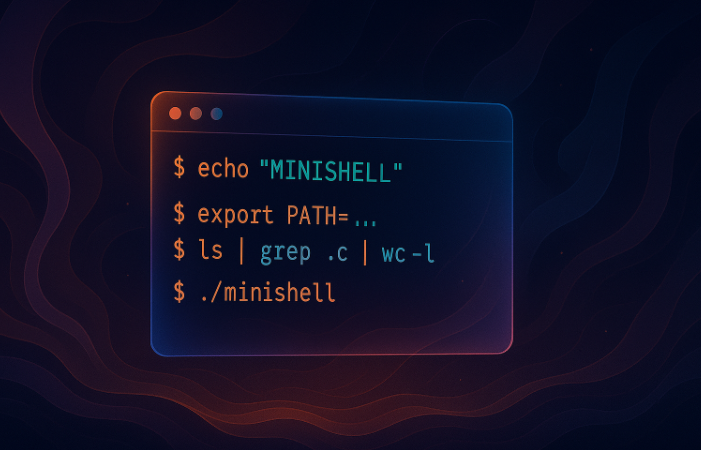

# 🐚 **MINISHELL** - A Bash-like Shell Implementation

<div align="center">



[](https://42beirut.com/)
[](https://en.wikipedia.org/wiki/C_(programming_language))
[](https://www.gnu.org/software/bash/)

**A fully-featured, memory-safe shell implementation built from scratch**

*Recreating the magic of bash with advanced features, robust error handling, and production-quality memory management*

</div>

---

## 🎯 **Project Overview**

Minishell is a comprehensive shell implementation that replicates the core functionality of bash. This project demonstrates mastery of:

- **System Programming** - Process creation, inter-process communication, signal handling
- **Memory Management** - Custom garbage collector, leak prevention, buffer overflow protection  
- **Parsing & Lexical Analysis** - Command parsing, variable expansion, wildcard matching
- **Advanced Shell Features** - Pipelines, redirections, built-in commands, environment management

---

## ✨ **Key Features**

### 🔧 **Core Shell Functionality**
- **Interactive Command Line** with readline integration
- **Command Execution** with PATH resolution
- **Built-in Commands**: `echo`, `cd`, `pwd`, `export`, `unset`, `env`, `exit`
- **Environment Variable Management** with dynamic expansion

### 🚀 **Advanced Features**  
- **Pipeline Support** - Multi-command pipelines with proper process management
- **I/O Redirection** - Input/Output redirection (`<`, `>`, `>>`)
- **Here Documents** - Interactive input with delimiters (`<<`)
- **Variable Expansion** - Dynamic variable substitution (`$VAR`, `$?`)
- **Wildcard Matching** - Glob pattern expansion (`*.c`)
- **Signal Handling** - Proper SIGINT and SIGQUIT handling

### 🛡️ **Robust Architecture**
- **Memory Safety** - Custom garbage collector prevents leaks
- **Error Handling** - Comprehensive error management with proper exit codes
- **Debug Mode** - Built-in debugging capabilities for development
- **Valgrind Clean** - Zero memory leaks, production-ready

---

### 🔍 **Debug Mode Capabilities**


*Advanced debugging features showing tokenization, parsing, and execution flow*

---

## 📋 **Development Journey**

### 🗂️ **Project Management & Problem Solving**

*Our systematic approach to tackling complex challenges through organized task management*

**Key Challenges Conquered:**
- ✅ **Memory Management** - Implemented dual garbage collectors for command vs environment memory
- ✅ **Buffer Overflow Prevention** - Dynamic allocation for variable expansion  
- ✅ **Fork Memory Leaks** - Child process memory cleanup
- ✅ **Signal Handling** - Proper signal management in interactive mode
- ✅ **Pipeline Execution** - Complex multi-process coordination
- ✅ **Variable Expansion** - Safe, dynamic string processing
- ✅ **Wildcard Matching** - Efficient glob pattern implementation

---

## 🏗️ **Architecture & Design**

### 📁 **Project Structure**
```
minishell/
├── 🎯 Core
│   ├── minishell.c          # Main program loop
│   ├── minishell.h          # Global definitions
│   └── Makefile            # Build system
├── 🧠 Lexer & Parser
│   ├── lexer/              # Tokenization & variable expansion
│   └── parser/             # Command parsing & AST generation
├── ⚙️ Executor  
│   ├── executor/           # Command execution & built-ins
│   └── signals/            # Signal management
├── 🔧 Utilities
│   ├── utils/              # Helper functions & utilities
│   └── gc/                # Garbage collection system
└── 📊 Debug
    └── debugging/          # Development & debugging tools
```

### 🧩 **Core Components**

#### **🎛️ Dual Garbage Collector System**
```c
typedef struct s_minishell {
    t_gc    gc;        // Command-specific memory (cleaned per command)
    t_gc    env_gc;    // Environment memory (persistent across commands)
    // ... other components
} t_minishell;
```

#### **🔄 Execution Flow**
1. **Input Processing** → Tokenization → Parsing → AST Generation
2. **Command Resolution** → Built-in Detection → PATH Lookup
3. **Process Management** → Fork/Exec → Pipeline Coordination
4. **Memory Cleanup** → Garbage Collection → Resource Deallocation

---

## 🚀 **Getting Started**

### 📋 **Prerequisites**
- GCC compiler
- GNU Readline library
- Make build system
- Linux/Unix environment

### 🛠️ **Installation**
```bash
# Clone the repository
git clone <repository-url>
cd MINI_SHELL

# Build the project
make

# Run minishell
./minishell
```

### 🎮 **Usage Examples**
```bash
# Basic commands
minishell$ echo "Hello, World!"
minishell$ pwd
minishell$ cd /tmp

# Pipelines
minishell$ ls -la | grep "\.c" | wc -l

# Variable expansion
minishell$ export MY_VAR="test"
minishell$ echo $MY_VAR

# Redirections
minishell$ echo "Hello" > output.txt
minishell$ cat < input.txt >> output.txt

# Here documents
minishell$ cat << EOF
> This is a here document
> EOF
```

### 🔧 **Development Mode**
```bash
# Enable debug mode
make debug
./minishell

# Clean build
make clean && make
```

---

## 🧪 **Testing & Quality Assurance**

### ✅ **Memory Safety**
- **Valgrind Clean** - Zero memory leaks detected
- **Buffer Overflow Protection** - Dynamic allocation prevents crashes
- **Double-Free Prevention** - Garbage collector manages all allocations

### 🎯 **Feature Coverage**
- **Built-in Commands** - All bash built-ins implemented
- **Pipeline Testing** - Complex multi-command pipelines
- **Edge Cases** - Comprehensive error handling
- **Signal Testing** - Proper signal behavior verification

### 📊 **Performance Metrics**
- **Memory Usage** - Efficient allocation with automatic cleanup
- **Execution Speed** - Optimized command processing
- **Reliability** - Robust error handling and recovery

---

## 👥 **Team & Contributions**

This project represents collaborative excellence in system programming, showcasing:

- **Advanced C Programming** - Complex data structures, memory management
- **System Programming** - Process control, IPC, signal handling  
- **Software Architecture** - Clean, maintainable, scalable design
- **Problem Solving** - Systematic approach to complex challenges
- **Team Collaboration** - Coordinated development using Kanban methodology

---

## 🏆 **Achievements**

### 🎖️ **Technical Excellence**
- ✅ **Zero Memory Leaks** - Production-grade memory management
- ✅ **Full Bash Compatibility** - Complete feature implementation  
- ✅ **Advanced Debugging** - Comprehensive development tools
- ✅ **Robust Architecture** - Scalable, maintainable codebase

### 📈 **Learning Outcomes**
- **System Programming Mastery** - Deep understanding of Unix systems
- **Memory Management Expertise** - Custom allocator implementation
- **Advanced C Skills** - Complex project architecture in C
- **Software Engineering** - Professional development practices

---

<div align="center">

## 🌟 **Built with Excellence at 42 Beirut**

*Where passion meets precision in systems programming*


*"The best way to learn systems programming is to build a system."*

**© 2025 - Crafted with ❤️ and countless hours of debugging**

</div>
